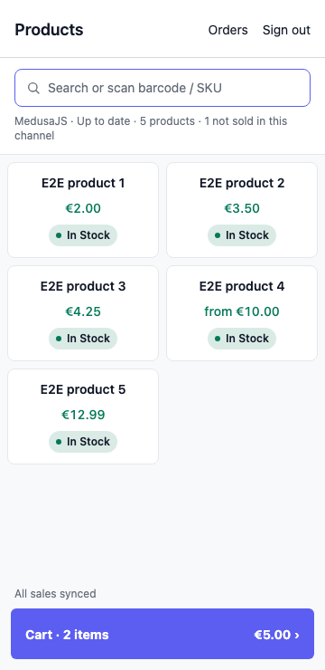
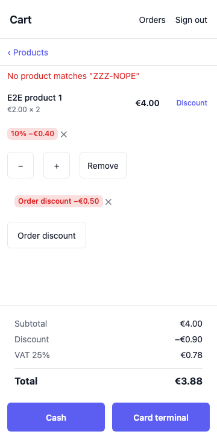
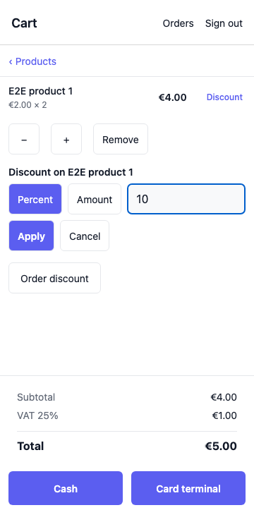
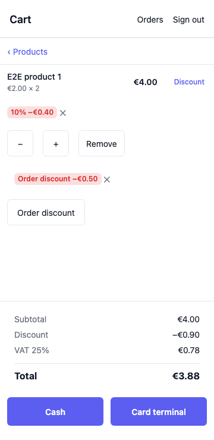
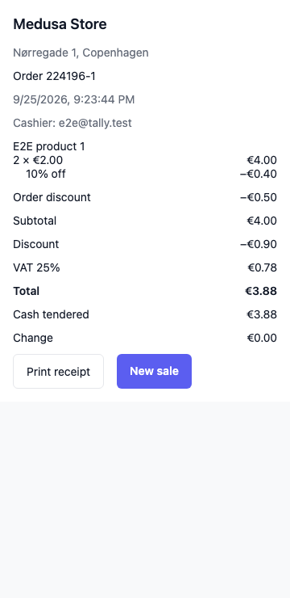

# Testing MedusaPOS

Thanks for testing MedusaPOS. This page is where to start; it links out for
setup detail rather than repeating it.

## What changed since your last round

- You can give a discount on a single line or on the whole order, and each
  discount's chip shows the amount actually taken off.
- On a phone, Products has a cart bar pinned to the bottom; open it for a
  full-height cart with the totals and pay buttons always in view.
- The receipt now adds up: each line before its own discount, that line's
  discount underneath it, then the order discount, then Subtotal, Discount,
  VAT and Total.
- A barcode scanner works in the phone cart view as well as on Products.
- The header fits on a phone screen.
- The variant chooser updates live as stock and price change.

## Try it

Open `https://app.medusapos.com` in a current Chrome, Edge, Safari or
Firefox, over HTTPS or on `localhost`. MedusaPOS stores sales and the
catalogue in the browser's own private storage; a browser without it shows
"MedusaPOS can't run in this browser" instead of opening.

Only one tab per store is ever live. Open a second tab and it takes over;
the first shows "MedusaPOS is open in another tab" with a **Use here**
button to take it back. Closing the live tab lets a waiting tab take over on
its own.

## Use the hosted demo store

The hosted demo store is coming soon — check back here for the backend URL
and demo login to sign in at `https://app.medusapos.com` without setting up
your own Medusa store.

<!--
Placeholder for the front desk to fill in when the demo is live:
Backend URL: <TBD>
Email: <TBD>
Password: <TBD>
-->

## Use your own Medusa backend

You'll need:

- A Medusa 2.21 store with the POS plugin installed.
- An admin user's email and password, without multi-factor authentication (MFA).
- An HTTPS backend URL — see QUICKSTART's ["What you need"](QUICKSTART.md#what-you-need)
  for when plain `http://` is allowed.

Add the POS origin to your backend's CORS settings, keeping any existing
origins, with no path or trailing slash, in your backend's `.env`, then
restart the backend:

```env
# Append to your existing origins — don't replace them.
ADMIN_CORS=<your existing origins>,https://app.medusapos.com
AUTH_CORS=<your existing origins>,https://app.medusapos.com
```

The POS signs in with your email and password at the backend's
`/auth/user/emailpass`, then sends the returned token as `Authorization:
Bearer` on every request after that. When the token expires, sales keep
queuing on the device and a "Sign in" strip asks for your password again to
send them — see [Sign-in and sync banners](#sign-in-and-sync-banners).

See the [tester quick-start](QUICKSTART.md) for installing the plugin,
configuring your store (sales channel, stock location, shipping option, tax,
a publishable API key) and creating an admin user.

## Set up this till

On first sign-in, MedusaPOS resolves your store's region, tax and sales
channel from Medusa. If your store has more than one region or publishable
API key, you're asked to pick them on a "Set up this till" screen; the
till's country always follows its stock location's country, so it's never
offered as a choice. If the region you pick doesn't cover that country, the
till says so ("Stock location … is in …, which region … does not cover.")
and lets you choose another. The choice is remembered for this store.

Prices shown are Medusa's own calculated prices for your chosen region, sale
prices included; products your sales channel doesn't sell are hidden.

## On a phone

Below 600 px wide — most phones — MedusaPOS switches to a single,
full-height view instead of showing products and the cart side by side:

- **Products** shows the catalogue with a cart bar pinned to the bottom, for
  example "Cart · 2 items €5.00 ›". Tap it to open the cart.
- The **cart** view shows "‹ Products" at the top to go back. Its totals and
  the Cash / Card terminal buttons stay in view at the bottom while the
  lines scroll above them.
- Adding a product keeps you on Products, so you can scan or tap several
  products in a row before opening the cart to check out.



## Scanning barcodes

- With a USB or Bluetooth barcode scanner set to type like a keyboard, scan
  on **Products**: the search box takes the code the same as if you'd typed
  it.
- Scanning also works from the phone **cart** view, so you don't need to go
  back to Products first. An unknown code shows `No product matches "…"`
  instead of adding anything.
- Typing into a discount box is never read as a scan, so entering a discount
  value there is never mistaken for a barcode.
- Camera scanning isn't available yet — see
  [Known limitations](#known-limitations).



## Discounts

Give a line a discount from its **Discount** action; give the whole order a
discount from the **Order discount** button below the lines. Either way:
choose **Percent** or **Amount**, enter the value, then **Apply**.



To remove a discount, tap its chip (the ✕). Each chip shows what actually
came off, not what you typed: a percent line discount reads, for example,
"10% −€0.40"; a fixed discount reads "−€0.40"; the order discount reads
"Order discount −€0.50".



A discount can never take more off than the line, or the order, is worth —
MedusaPOS refuses it rather than show a negative price. If your store
doesn't yet support discounts, applying one is refused too, and the app
says so in the discount form instead of adding it.

## The receipt

Each line lists before any discount, as quantity × unit price. Its own
discount, if it has one, is a row underneath. Below the lines, an order
discount (if any) gets its own row. Then Subtotal, Discount, VAT (or
"incl. VAT" if your store's prices include tax) and Total.

For example, selling 2 of a €2.00 product with 10% off the line and €0.50
off the whole order:

- 2 × €2.00: €4.00
- 10% off: −€0.40
- Order discount: −€0.50
- Subtotal: €4.00
- Discount: −€0.90
- VAT 25%: €0.78
- Total: €3.88

Subtotal is every line before its own discount, added up. Discount is every
discount added together. VAT is worked out on what's left after discounts.
Total is Subtotal − Discount + VAT, or Subtotal − Discount if your store's
prices already include tax.



## Sign-in and sync banners

A banner can appear at the top of the screen while a sale can't reach the
store yet:

- **Sign in again**: if your sign-in has expired, a strip says your sales
  are saved and waiting to send, with a **Sign in** link — enter your
  password there to send them.
- **Not accepted**: if the store refuses a whole batch of sales, a banner
  says how many aren't accepted, with **Details** and a **Try again**
  button once the store's fixed — see
  [Orders that need attention](#orders-that-need-attention).
- **Waiting to sync**: while a sale hasn't reached the store yet, Products
  shows how many sales are waiting to sync, and Orders lists each one as
  "Waiting to sync" — see [Offline](#offline).

## Offline

You can keep selling from the catalogue already loaded on the device: a
sale queues on the device and is listed under **Orders** as "Waiting to
sync"; it's sent to Medusa exactly once when you're back online.

You do need a connection for your first sign-in and for the initial
catalogue load — let the catalogue load while online before you start
selling offline. After that, your store settings are cached, so the till
opens offline too (an "Offline" note with **Retry** while it can't reach the
store).

There's no offline page cache (no service worker), so reloading or
reopening the app while offline fails. Once the app is open, a reload while
you're online keeps any sales still waiting to sync.

## Orders that need attention

Open **Orders** → **Needs attention** to see sales that need a look:

- A sale the store rejected shows a **Retry** button, which sends it again.
- Some rejections instead say the sale needs checking against the store
  before it can be sent again — there's no Retry for those; check the sale
  against the store first.
- A "*N* sales not accepted · Details" strip at the top of the screen means
  the store is refusing the whole batch: those sales stay safely on the
  register, and **Try again** resends them once the store is fixed.

## Known limitations

- Prices are re-checked every 30 minutes, and base prices nightly, so they
  are not live to the second; stock is reconciled on its own cadence — see
  the README's [Known limitations](../README.md#known-limitations) section
  for the full picture.
- Camera scanning isn't available yet — use a USB or Bluetooth barcode
  scanner set to type like a keyboard instead (see
  [Scanning barcodes](#scanning-barcodes)).

## Report a problem

The fastest way: tap **Send feedback**, on the sign-in screen or the Orders
screen, which opens a GitHub issue form in your browser. You can also open
it directly:
`https://github.com/medusapos/app/issues/new?template=tester-feedback.yml`.

The form asks for your app version, backend host, device and browser, what
happened, steps to reproduce and what you expected. The backend URL is
always reduced to its host — never the full URL, path or credentials.
